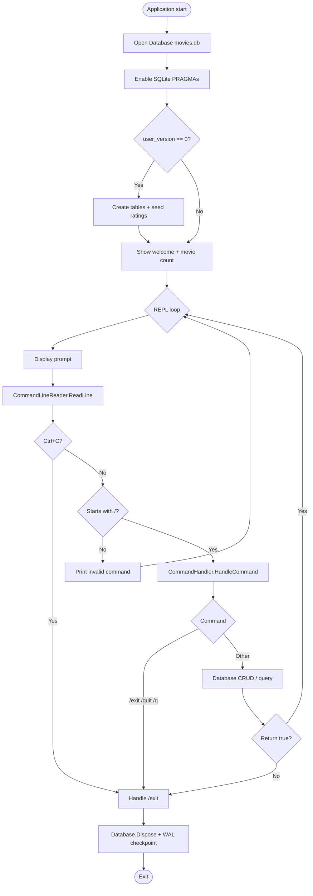

# MovieCLI

A terminal-based movie collection manager backed by SQLite. Type slash commands in an interactive REPL to add, list, search, import, export, and delete movies. Output uses [Spectre.Console](https://spectreconsole.net/) for colored tables and markup.

## Functionalities

| Command          | Alias         | Description                                                          |
| ---------------- | ------------- | -------------------------------------------------------------------- |
| `/help`          | —             | Show available commands                                              |
| `/list`          | `/ls`         | List all movies in a formatted table (ratings are color-coded)       |
| `/add`           | —             | Add a movie: title, year, genre, rating ID, optional IMDb URL        |
| `/find`          | —             | Look up a movie by numeric ID or title (partial title match)         |
| `/delete`        | `/rm`         | Remove a movie by ID or exact title (case-insensitive)               |
| `/export text`   | —             | Write all movies as `/add` lines to `export.txt`                     |
| `/export sql`    | —             | Write ratings and movies as SQL `INSERT` statements to `export.sql`  |
| `/import <path>` | —             | Import movies from an exported `.txt` file (one `/add` line per row) |
| `/exit`          | `/quit`, `/q` | Exit the application                                                 |

**Interactive input**

- Command history with **Up/Down** arrow keys
- **Tab** completion for command names
- **Ctrl+C** exits cleanly (WAL journal is checkpointed on shutdown)
- When stdin is redirected (pipe or file), standard `Console.ReadLine()` is used instead

**Data model**

- Movies are stored in SQLite (`movies.db` in the working directory)
- Each movie has: ID, title, year, genre, rating, and optional IMDb URL
- Ratings are fixed lookup values (not free text):

| ID  | Rating    |
| --- | --------- |
| 1   | Very Poor |
| 2   | Poor      |
| 3   | Average   |
| 4   | Good      |
| 5   | Excellent |

Duplicate movies (same title + year, case-insensitive) cannot be added.

## Usage

### Prerequisites

- [.NET SDK](https://dotnet.net/) (supports [C# file-based apps](https://learn.microsoft.com/en-us/dotnet/core/sdk/file-based-apps) with `#:package` directives)
- Dependencies are declared in `Program.cs` and restored automatically on first run:
  - `Microsoft.Data.Sqlite`
  - `Spectre.Console`

### Run

From the project directory:

```bash
dotnet run Program.cs
```

On Windows, you can also double-click or run:

```bat
movies.bat
```

### Examples

```text
/add "The Matrix" 1999 "Sci-Fi" 5 "https://www.imdb.com/title/tt0133093/"
/list
/find Matrix
/find 1
/delete 1
/delete "The Matrix"
/export text
/import export.txt
/help
/exit
```

**Adding a movie**

```text
/add <title> <year> <genre> <rating_id> [imdb_url]
```

Use quotes around title, genre, or URL when they contain spaces:

```text
/add "Blade Runner 2049" 2017 "Sci-Fi" 4
```

**Export / import**

- `/export text` creates `export.txt` with lines you can re-import via `/import export.txt`
- `/export sql` creates `export.sql` for use with the SQLite CLI or another SQL client

## High-level overview of classes

All types live in `Program.cs` as `file`-scoped classes (single-file app).

| Class / record           | Role                                                                                                                                                                                                                      |
| ------------------------ | ------------------------------------------------------------------------------------------------------------------------------------------------------------------------------------------------------------------------- |
| **`CommandLineReader`**  | Reads user input from the terminal. Handles history navigation, tab completion for commands, and Ctrl+C. Falls back to `Console.ReadLine()` when input is redirected.                                                     |
| **`CommandHandler`**     | Parses slash commands and arguments (including quoted strings), dispatches to the correct handler, and returns whether the REPL should continue.                                                                          |
| **`Database`**           | Opens `movies.db`, applies SQLite PRAGMAs (WAL, foreign keys, etc.), runs schema initialization on first launch, and exposes CRUD/query methods. Implements `IDisposable` and checkpoints the WAL on writes and shutdown. |
| **`Movie`**              | Input model for adding a movie (title, year, genre, rating ID, optional IMDb URL).                                                                                                                                        |
| **`MovieListItem`**      | Read model returned for list/find operations; rating is resolved to its display name via a join.                                                                                                                          |
| **`MovieItemForExport`** | Raw movie row used when generating export files (includes `rating_id`).                                                                                                                                                   |
| **`Rating`**             | Rating lookup row (`id`, name) used for SQL export.                                                                                                                                                                       |

## Flow / lifecycle

### Startup

1. Open SQLite connection to `movies.db`
2. Enable PRAGMAs (WAL journal, foreign keys, busy timeout, etc.)
3. If `user_version` is `0`, create `ratings` and `movies` tables, seed the five ratings, and set `user_version = 1`
4. Construct `CommandHandler` and `CommandLineReader`
5. Print welcome message with current movie count

### Main loop

1. Prompt with `>`
2. Read a line (interactive or redirected)
3. Reject input that does not start with `/`
4. Parse command + arguments and dispatch via `CommandHandler`
5. Exit commands (`/exit`, `/quit`, `/q`) or Ctrl+C break the loop

### Shutdown

1. `Database.Dispose()` runs (via `using` at top level)
2. Final WAL checkpoint (`PRAGMA wal_checkpoint(TRUNCATE)`) ensures the database file is left in a consistent state



## Limitations

- **Single-file, no project file** — The app is one `Program.cs` script; there is no `.csproj`, test suite, or separate configuration layer.
- **No edit command** — Movies can be added and deleted, but not updated in place.
- **Rating as numeric ID** — `/add` expects a rating ID (1–5), not a label like `"Good"`. Invalid IDs may fail at the database layer (foreign key constraint).
- **No rating ID validation in `/add`** — Only year and rating are parsed as integers; genre and title are accepted as-is.
- **Duplicate rule is title + year only** — Same title in a different year is allowed; same title and year is blocked (case-insensitive).
- **Find vs delete title behavior differs** — `/find` uses partial, case-insensitive `LIKE` matching; `/delete` by title requires an exact case-insensitive match.
- **Import restrictions** — Only `.txt` files containing `/add` lines are supported; SQL export files cannot be imported through `/import`.
- **Fixed export paths** — Exports always write to `export.txt` or `export.sql` in the current working directory (no custom output path).
- **Schema versioning** — Only the initial schema (version 1) is created; there are no migrations for future schema changes.
- **Platform helper** — `movies.bat` is Windows-oriented; other platforms use `dotnet run Program.cs` directly.
